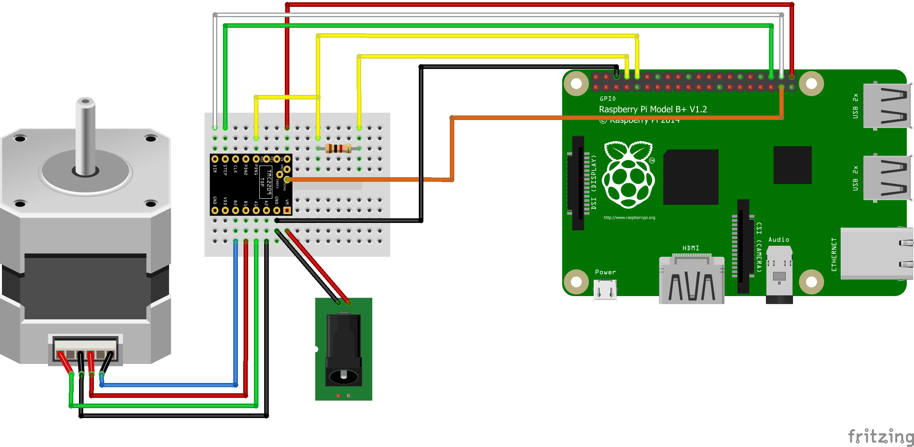

# TMC_2209_Raspberry_Pi

**Pin parameter order in constructor has changed in version 0.1.8 to EN, STEP, DIR !**
\
\
This is a library to drive a stepper motor with a TMC2209 stepper driver and a Raspberry Pi

This code is still experimental, so use it on your own risk.

This library is programmed in pure Python. The performance of Python is not good enough to drive the motor with high speed.
So if you move the motor with high speed and this library the motor will lose steps.

My TMC2209 is a Bigtreetech TMC 2209 V1.2:
https://github.com/bigtreetech/BIGTREETECH-TMC2209-V1.2

It has a rSense of 110 mOhm and it uses one Pin (PDN_UART) for UART RX and TX.
So the PD_UART-Pin needs to be connected to the Raspberrry Pis RX-Pin directly and to the TX-Pin with an 1kOhm resistor.
You can read more about this in the datasheet from Trinamic.

Because the TMC2209 use one shared pin for transmit and receive in the UART communication line, the Raspberry Pi also receives what it sends,
Well, the Pi receives 8 bits from itself and 4 bit from the driver. So the Pi receives a total of 12 bits and only the last 4 needs to be used.

the code to run the stepper motor is based on the code of the AccelStepper Library from Mike McCauley:  
https://github.com/adafruit/AccelStepper  
http://www.airspayce.com/mikem/arduino/AccelStepper/

the code for the uart communication is based on this code from troxel:  
https://github.com/troxel/TMC_UART

the Documentation of the TMC2209 can be found here:  
https://www.trinamic.com/fileadmin/assets/Products/ICs_Documents/TMC2209_Datasheet_rev1.06.pdf

the code is also available on PyPI:
https://pypi.org/project/TMC-2209-Raspberry-Pi


## Installation
### Installation with PIP
```
pip3 install TMC-2209-Raspberry-Pi
```
### Installation with GIT
- clone this repo to your Raspberry Pi using  
```
git clone https://github.com/Chr157i4n/TMC2209_Raspberry_Pi
```
- install the python module bitstring with  
```
pip3 install bitstring
```
- enable the serial port in  
```
sudo raspi-config
```

## Wiring
Pin TMC2209 | connect to | Function
-- | -- | --
TX or PDN_UART with 1kOhm | TX of Raspberry Pi | send data to TMC via UART
RX or PDN_UART directly | RX of Raspberry Pi | receive data from TMC via UART
VM | 12V or 24V of power supply | power for the motor
GND | GND of power supply | power for the motor
VDD | 5V of Raspberry Pi | does not need to be connected
GND2 | GND of Raspberry Pi | GND for VDD and Signals
EN | GPIO21 of Raspberry Pi | enable the motor output
STEP | GPIO16 of Raspberry Pi | moves the motor one step per pulse
DIR | GPIO20 of Raspberry Pi | set the direction of the motor
DIAG | GPIO26 of Raspberry Pi | optional, for StallGuard



The GPIO pins can be specific when initiating the class.
If you test this on a breadboard, make sure to cut off the bottomside of the pins (Vref and DIAG) next to the EN pin, so that they are not shorted trough the breadboard.


## Tests
You can run the test files from the main directory with
```
python3 -m tests.test_script_01_uart_connection
```

#### [test_script_01_uart_connection.py](tests/test_script_01_uart_connection.py)
this only communicates with the TMC driver over UART. It should set some settings in the driver and then outputs the settings.
When it outputs ```TMC2209: after 10 tries not valid answer. exiting```, you need to check the UART-connection.

#### [test_script_02_pin_connection.py](tests/test_script_02_pin_connection.py)
this scripts enables the raspberry GPIO output for the dir, en and step pin and then checks the tmc driver register, 
whether the driver sees them as HIGH or LOW. Because then enable pin is activated for a short time, the motor current ouput
will be also activated in this script for a short time.
This script should output: 
Pin DIR:        OK
Pin STEP:       OK
Pin EN:         OK
if not, check the connection of the pin

#### [test_script_03_basic_movement.py](tests/test_script_03_basic_movement.py)
this script should move the motor 6 times one revolution back and forth.

####  [test_script_04_stallguard.py](tests/test_script_04_stallguard.py)
in this script the stallguard feature of the TMC2209 is beeing setup.
a funtion will be called, if the driver detects a stall. the function stops the current movement.
The motor will be moved 10 revolutions. If the movement is unhindered finished, the script outputs ```Movement finished successfully```.
If you block the motor with pliers or so, the the motor will stop and the script outputs ```StallGuard!``` and ```Movement was not completed```

####  [test_script_05_vactual.py](tests/test_script_05_vactual.py)
VACTUAL allows moving the motor by UART control. It gives the motor velocity in +-(2^23)-1 [μsteps / t]

####  [test_script_06_multiple_drivers.py](tests/test_script_06_multiple_drivers.py)
Multiple drivers can be addressed via UART by setting different addresses with the MS1 and MS2 pins.
Simultaneous movement of multiple motors is currently not supported.

\
\
For me this baudrates worked fine: 19200, 38400, 57600, 115200, 230400, 460800, 576000

If the TMC2209 driver is connected to Vmotor, the internal voltage regulator will create the Vio for the chip.
So you dont need to connect anything to the Vio pin of the driver.


## Usage
```python
from TMC_2209.TMC_2209_StepperDriver import *
tmc = TMC_2209(16, 20, 21)

tmc.setDirection_reg(False)
tmc.setCurrent(300)
tmc.setInterpolation(True)
tmc.setSpreadCycle(False)
tmc.setMicrosteppingResolution(2)
tmc.setInternalRSense(False)

tmc.setAcceleration(2000)
tmc.setMaxSpeed(500)

tmc.setMotorEnabled(True)

tmc.runToPositionSteps(400)
tmc.runToPositionSteps(0)

tmc.setMotorEnabled(False)
```


## Troubleshoot
if you encounter any problem, feel free to open an issue

Problem | Solution 
-- | --
FileNotFoundError: [Errno 2] <br /> No such file or directory: '/dev/serial0' | depending on your Raspberry Pi version, you need to enable the Serial Port <br /> run `sudo raspi-config` in your terminal. <br /> there go to '3 Interface Options' -> 'P3 Serial Port' <br /> Would you like a login shell to be accessible over serial? No <br /> Would you like the serial port hardware to be enabled? Yes <br /> Finish and then reboot
PermissionError: [Errno 13] <br /> Permission denied: '/dev/serial0' | you need to give the permission to acces the Serial Port to your current user <br /> You may need to add your user (pi) to the dialout group with `sudo usermod -a -G dialout pi`
"TMC2209: UART Communication Error" | You can use the 'debug_script_01_uart_connection' script to get a better reading on the received bytes and troubleshoot your problem
"TMC2209: UART Communication Error: 0 data bytes \| 4 total bytes" | only 4 total bytes receives indicates, that the Raspberry Pi receives its own data, but nothing from the TMC driver. This happens if RX and TX are connected properly, but the TMC driver has no power
"TMC2209: UART Communication Error: 0 data bytes \| 0 total bytes" | 0 total bytes receives indicates, a problem with your wiring or your Raspberry Pi. This happens if TX is not connected
"TMC2209: UART Communication Error: 4 data bytes \| 12 total bytes" | this indicates, the Raspberry Pi received only zeroes. This happens if only RX is connected and TX not
"the Raspberry Pi received only the sended bits" or<br /> inconsistent received bits | Make sure the UART ist properly connected to the TMC driver and the driver is powered and working. <br /> Make sure login shell (console) over serial is disabled

