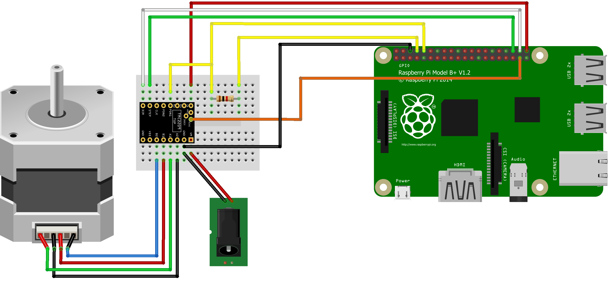

# TMC_2209_Raspberry_Pi

[](https://pypi.org/project/TMC-2209-Raspberry-Pi)
[](https://pypi.org/project/TMC-2209-Raspberry-Pi)
[](https://pypi.org/project/TMC-2209-Raspberry-Pi)
[](https://GitHub.com/Chr157i4n/TMC2209_Raspberry_Pi/issues/)

\
\
This is a library to drive a stepper motor with a TMC2209 stepper driver and a Raspberry Pi.

This code is still experimental, so use it on your own risk.

This library is programmed in pure Python. The performance of Python is not good enough to drive the motor with high speed.
So if you move the motor with high speed using this library the motor will lose steps.

Tested on a [Bigtreetech TMC2209 V1.2](https://github.com/bigtreetech/BIGTREETECH-Stepper-Motor-Driver/tree/master/TMC2209/V1.2) and [Bigtreetech TMC2209 V1.3](https://github.com/bigtreetech/BIGTREETECH-Stepper-Motor-Driver/tree/master/TMC2209/V1.3).

It has a rSense of 110 mOhm and it uses one Pin (PDN_UART) for UART RX and TX.
So the PDN_UART-Pin needs to be connected to the Raspberrry Pis RX-Pin directly and to the TX-Pin with an 1kOhm resistor.
You can read more about this in the datasheet from Trinamic.

Because the TMC2209 uses one shared pin for transmit and receive in the UART communication line, the Raspberry Pi also receives what it sends.
Well, the Pi receives 4 bytes from itself and 8 bytes from the driver. So the Pi receives a total of 12 bytes and only the last 8 are the reply, of which only 4 are data bytes.

The Documentation of the TMC2209 can be found here:
[TMC2209 - Datsheet](https://www.analog.com/media/en/technical-documentation/data-sheets/TMC2209_datasheet_rev1.09.pdf)

The code is also available on [PyPI](https://pypi.org/project/TMC-2209-Raspberry-Pi).

## Installation

### Installation with PIP

```shell
pip3 install TMC-2209-Raspberry-Pi
```

### Installation with GIT

- clone this repo to your Raspberry Pi using

    ```shell
    git clone https://github.com/Chr157i4n/TMC2209_Raspberry_Pi
    ```

- install the required modules

    ```shell
    pip3 install RPi.GPIO pyserial
    ```

- enable the serial port in

    ```shell
    sudo raspi-config
    ```

### Board Support

The following table shows the supported boards and which libraries for GPIO access is beeing used for that board.

Library     | Installation Parameter    | Boards
----------- | ------------------------- | -----------
RPi.GPIO    | RASPBERRY_PI              | Pi4, Pi3 etc.
gpiozero    | RASPBERRY_PI5             | Pi5
Jetson.GPIO | NVIDIA_JETSON             | Nvidia Jetson
pheriphery  | LUCKFOX_PICO              | Luckfox Pico
pheriphery  | LUCKFOX_PICO              | Luckfox Pico
OPi.GPIO    | ORANGE_PI                 | Orange Pi

Those libraries are needed for this library to work. You can either install the correct library yourself.
You can also install the needed GPIO library by specifing the Installation Parameter while installing this library:

```shell
pip3 install TMC-2209-Raspberry-Pi[RASPBERRY_PI]
```

## Wiring

Pin TMC2209 | connect to | Function
-- | -- | --
TX or PDN_UART with 1kOhm | TX of Raspberry Pi | send data to TMC via UART
RX or PDN_UART directly | RX of Raspberry Pi | receive data from TMC via UART
VDD | 3,3V of Raspberry Pi | optional, for more stable logic voltage
GND | GND of Raspberry Pi | GND for VDD and Signals
VM | 12V or 24V of power supply | power for the motor
GND | GND of power supply | power for the motor
EN | GPIO21 of Raspberry Pi | enable the motor output
STEP | GPIO16 of Raspberry Pi | moves the motor one step per pulse
DIR | GPIO20 of Raspberry Pi | set the direction of the motor
DIAG | GPIO26 of Raspberry Pi | optional, for StallGuard



The GPIO pins can be specific when initiating the class.
If you test this on a breadboard, make sure to cut off the bottomside of the pins (Vref and DIAG) next to the EN pin, so that they are not shorted trough the breadboard.

## Demo scripts

You can run the demo scripts files from the main directory with

```shell
python3 -m demo.demo_script_01_uart_connection
```

### [demo_script_01_uart_connection.py](demo/demo_script_01_uart_connection.py)

This only communicates with the TMC driver over UART. It should set some settings in the driver and then outputs the settings.
When it outputs ```TMC2209: UART Communication Error```, you need to check the UART-connection.

### [demo_script_02_pin_connection.py](demo/demo_script_02_pin_connection.py)

This script enables the raspberry GPIO output for the dir, en and step pin and then checks the TMC driver register,
whether the driver sees them as HIGH or LOW. Because the enabled pin is activated for a short time, the motor current ouput
will be also activated in this script for a short time.
This script should output:
Pin DIR:        OK
Pin STEP:       OK
Pin EN:         OK
if not, check the connection of the pin.

### [demo_script_03_basic_movement.py](demo/demo_script_03_basic_movement.py)

This script should move the motor 6 times, one revolution back and forth.

### [demo_script_04_stallguard.py](demo/demo_script_04_stallguard.py)

In this script the stallguard feature of the TMC2209 is beeing setup.
A funtion will be called, if the driver detects a stall. The function stops the current movement.
The motor will be moved 10 revolutions. If the movement is finished unhindered, the script outputs ```Movement finished successfully```.
If you block the motor with pliers or something similar, the the motor will stop and the script outputs ```StallGuard!``` and ```Movement was not completed```

### [demo_script_05_vactual.py](demo/demo_script_05_vactual.py)

VACTUAL allows moving the motor by UART control. It gives the motor velocity in +-(2^23)-1 [μsteps / t]

### [demo_script_06_multiple_drivers.py](demo/demo_script_06_multiple_drivers.py)

Multiple drivers can be addressed via UART by setting different addresses with the MS1 and MS2 pins.
Simultaneous movement of multiple motors can be done with threaded movement.

### [demo_script_07_threads.py](demo/demo_script_07_threads.py)

In this script, the movement of a stepper with threads is shown. This can be used to do other task while moving a motor, or to move several motors simultaneous.

### [demo_script_08_log_to_file.py](demo/demo_script_08_log_to_file.py)

This script shows how you can alter the formatting of the TMC2209 log messages and redirect the log output to a file called `tmc2209_log_file.log` that will be created in the current directory.

\
\
For me these baudrates worked fine: 19200, 38400, 57600, 115200, 230400, 460800, 576000.

If the TMC2209 driver is connected to the Vmotor, the internal voltage regulator will create the Vio for the chip.
So you don't need to connect anything to the Vio pin of the driver.

## Usage

```python
from TMC_2209.TMC_2209_StepperDriver import *
tmc = TMC_2209(21, 16, 20)

tmc.set_direction_reg(False)
tmc.set_current(300)
tmc.set_interpolation(True)
tmc.set_spreadcycle(False)
tmc.set_microstepping_resolution(2)
tmc.set_internal_rsense(False)

tmc.set_acceleration(2000)
tmc.set_max_speed(500)

tmc.set_motor_enabled(True)

tmc.run_to_position_steps(400)
tmc.run_to_position_steps(0)

tmc.set_motor_enabled(False)
```

## Troubleshoot

If you have questions please check out the [Wiki](https://github.com/Chr157i4n/TMC2209_Raspberry_Pi/wiki) and the other issues.

If you encounter any problems, feel free to open an issue (ENG/GER).
Please don't send any E-Mails to me. Pls use Github, so that i don't need to answer the same question multiple times.
I reserve the right not to answer E-Mails.

Problem | Solution
-- | --
FileNotFoundError: [Errno 2] No such file or directory: '/dev/serial0' | depending on your Raspberry Pi version, you need to enable the Serial Port <br /> run `sudo raspi-config` in your terminal. <br /> there go to '3 Interface Options' -> 'P3 Serial Port' <br /> Would you like a login shell to be accessible over serial? No <br /> Would you like the serial port hardware to be enabled? Yes <br /> Finish and then reboot
PermissionError: [Errno 13] <br /> Permission denied: '/dev/serial0' | you need to give the permission to acces the Serial Port to your current user <br /> You may need to add your user (pi) to the dialout group with `sudo usermod -a -G dialout pi` and then relog. <br /> If that does not work, make sure that your user has read/write permissions on the dev file `/dev/serial0` by calling `sudo chmod 660 /dev/serial0`.
"TMC2209: UART Communication Error" | You can use the 'debug_script_01_uart_connection' script to get a better reading on the received bytes and troubleshoot your problem
"TMC2209: UART Communication Error: 0 data bytes \| 4 total bytes" | only 4 total bytes received indicates, that the Raspberry Pi receives its own data, but nothing from the TMC driver. This happens if RX and TX are connected properly, but the TMC driver has no power
"TMC2209: UART Communication Error: 0 data bytes \| 0 total bytes" | 0 total bytes received indicates, a problem with your wiring or your Raspberry Pi. This happens if TX is not connected
"TMC2209: UART Communication Error: 4 data bytes \| 12 total bytes" | this indicates, the Raspberry Pi received only zeroes. This happens if only RX is connected and TX not
"the Raspberry Pi received only the sended bits" or<br /> inconsistent received bits | Make sure the UART ist properly connected to the TMC driver and the driver is powered and working. <br /> Make sure login shell (console) over serial is disabled.


## Acknowledgements

The code to run the stepper motor is based on the code of the [AccelStepper Library from Mike McCauley](http://www.airspayce.com/mikem/arduino/AccelStepper).

The code for the UART communication is based on this [code from troxel](https://github.com/troxel/TMC_UART).

My goal is to make a library, that can run a stepper motor with a TMC2209 stepper driver and can write the setting in the register of the TMC2209, entirely in Python.
The main focus for this are Test setups, as Python is not fast enough for high motor speeds.

## Feedback/Contributing

If you encounter any problem, feel free to open an issue on the Github [issue page](https://github.com/Chr157i4n/TMC2209_Raspberry_Pi/issues).
Feedback will keep this project growing and I encourage all suggestions.
Feel free to submit a pull request on the dev branch.
