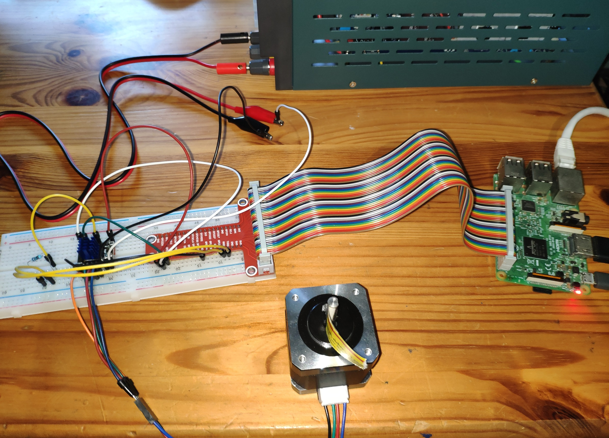
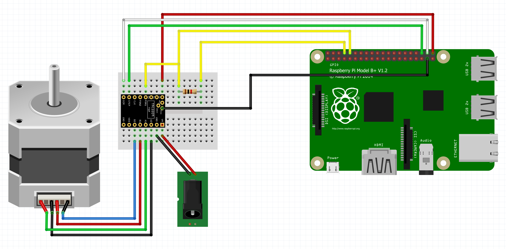

# TMC_2209_Raspberry_Pi
This is a libary to drive a stepper motor with a TMC2209 stepper driver and a Raspberry Pi

This code is still experimental, so use it on your own risk.

This libary is programmed in pure Python. The performance of Python is not good enough to drive the motor with high speed.
So if you move the motor with high speed and this libary the motor will loose steps.

My TMC2209 is a driver from Watterott:
https://shop.watterott.com/SilentStepStick-TMC2209-V2_1

It has a rSense of 110 mOhm and it uses one Pin (PDN_UART) for UART RX and TX.
So the PD_UART-Pin needs to be connected to the Raspberrry Pis RX-Pin directly and to the TX-Pin with an 1kOhm resistor.
You can read more about this in the datasheet from Trinamic.

Because the TMC2209 use one shared pin for transmit and receive in the UART communication line, the Raspberry Pi also receives what it sends,
Well, the Pi receive 8 bits from itself and 4 bit from the driver. So the Pi receives a total of 12 bits and only the last 4 needs to be used.

the code to run the stepper motor is based on the code of the AccelStepper Libary from Mike McCauley:
https://github.com/adafruit/AccelStepper
http://www.airspayce.com/mikem/arduino/AccelStepper/

the code for the uart communicationis based on this code from troxel:
https://github.com/troxel/TMC_UART

the Documentation of the TMC2209 can be found here:
https://www.trinamic.com/fileadmin/assets/Products/ICs_Documents/TMC2209_Datasheet_rev1.06.pdf

## Installation
- clone this repo to your Raspberry Pi using "git clone https://github.com/Chr157i4n/TMC2209_Raspberry_Pi"
- install the python module bitstring with "pip3 install bitstring"
- enable the serial port in "raspi-config"

## Usage
1. run the script "test_script_01_uart_connection.py"
this only communicates with the TMC driver over UART. It should set some settings in the driver and then outputs the settings.
When it outputs "TMC2209: after 10 tries not valid answer. exiting", you need to check the UART-connection.

2. run the script "test_script_02_pin_connection.py"
this scripts enables the raspberry GPIO output for the dir, en and step pin and then checks the tmc driver register, 
whether the driver sees them as HIGH or LOW. Because then enable pin is activated for a short time, the motor current ouput
will be also activated in this script for a short time.
This script should output: 
Pin DIR:        OK
Pin STEP:       OK
Pin EN:         OK
if not, check the connection of the pin

3. run the script "test_script_03_basic_movement.py"
this script should move the motor 6 times one revolution back and forth.

4. run the script "test_script_04_stallguard.py"
in this script the stallguard feature of the TMC2209 is beeing setup.
a funtion will be called, if the driver detects a stall. the function stops the current movement.
The motor will be moved 10 revolutions. If the movement is unhindered finished, the script outputs "Movement finished successfully".
If you block the motor with pliers or so, the the motor will stop and the script outputs "StallGuard!" and "Movement was not completed"

For me this baudrates worked fine: 19200, 38400, 57600, 115200, 230400, 460800, 576000

If the TMC2209 driver is connected to Vmotor, the internal voltage regulator will create the Vio for the chip.
So you dont need to connect anything to the Vio pin of the driver.

The function setCurrent only works correctly if the Vref voltage ist 1.2V, otherwise change Vref to 1.2V or
give the actual Vref as parameter to the setCurrent function.

